# Stay Weird Studios

## **Code Institute - Portfolio Project 5: Ecommerce Project** 

This is a e-commerce website based for a local studio run by my fiance and a fun project to help a local business owner gain traction and stand out in the music scene in Limerick.

## Table of contents
+ [User Experience](#User-Experience)
     + [Project Goals](#Project-Goals)
     + [User Stories](#User-Stories)
     + [Strategy](#Strategy)
     + [Scope](#Scope)
     + [Structure](#Structure)
     + [Skeleton](#Skeleton)
          + [Wireframes](#Wireframes)
     + [Surface](#Surface)
+ [Features](#Features) 
     + [Existing Features](#Existing-Features)
     + [Features to Implement in the future](#Features-to-Implement-in-the-future)
+ [Database](#Database)
+ [Testing](#Testing)
+ [Bugs](#Bugs)
+ [Technologies Used](#Technologies-Used)
     + [Resources](#Resources)
     + [Tools](#Tools)
+ [Deployment](#Deployment)
     + [Heroku Deployment](#Heroku-Deployment)
+ [Credits](#Credits)

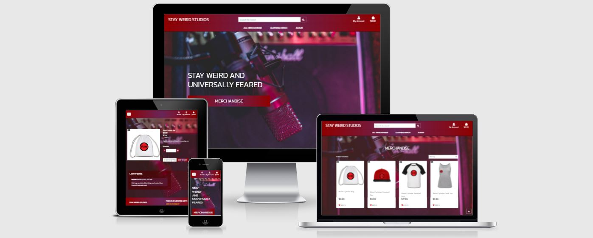

***
# User Experience
## Project Goals
The primary goal of this project is to create an ecommerce store for Stay Weird Studios using its branding to create a pleasant user experience for anyone who wishes to purchase any merchandise which consists of an array of clothing aswell as means of supporting the artist by paying for an album. 

## User Stories

### Core 
- As a **shopper** I want to be able to **view merchandise** so I can **browse the website for purchases**
- As a **shopper** I want to be able to **clearly see specific merch and services** so I can **avoid searching through the entire site or range of products**
- As a **shopper** I want to be able to **quickly see my total of purchases** so I can **avoid spending too much**
- As a **shopper** I want to be able to **see a list of services** so I can **pick the specific service for my needs**
- As a **shopper** I want to be able to **see the price of all services** so I can **know the price in advance of payment**

### Authentication 
- As a **site user** I want to be able to **register for an account** so I can **view my personal profile**
- As a **site user** I want to be able to **login and logout** so I can **access and secure my personal information**
- As a **site user** I want to be able to **recover my password** so I can **recover access to my account if password is forgotton**
- As a **site user** I want to be able to **receive a confirmation email** so I can **verify my account**
- As a **site user** I want to be able to **have a personal profile** so I can **save payment information**

### Sorting/Searching

- As a **shopper** I want to be able to **sort specific products/services** so I can **find the best price for those products/services**
- As a **shopper** I want to be able to **see a list of available products/services** so I can **find and purchase the one I need**
- As a **shopper** I want to be able to **search for products/services by name** so I can **easily find a specific product/service**
- As a **shopper** I want to be able to **easily see results and availability from searchs** so I can **quickly see if that product/service is currently available**

### Payment

- As a **shopper** I want to be able to **select sizes and quantity of merch** so I can **ensure the wrong size/quantity is not purchased**
- As a **shopper** I want to be able to **view items or service in cart** so I can **identify total cost for checkout**
- As a **shopper** I want to be able to **alter the quantity of goods** so I can **make changes before purchasing**
- As a **shopper** I want to be able to **enter payment details** so I can **buy services or products**
- As a **shopper** I want to be able to **ensure I feel safe purchasing** so I can **make payments confidently**
- As a **shopper** I want to be able to **view order confirmation after checkout** so I can **verify there are no mistakes in my order or details**
- As a **shopper** I want to be able to **receive an email after checkout** so I can **confirm the payment for the order was successful**

### Admin

- As a **store owner** I want to be able to **add products** so I can **add new merchandise and services to store**
- As a **store owner** I want to be able to **edit/update products/services** so I can **change item details if needed**
- As a **store owner** I want to be able to **delete products** so I can **remove items/services no longer available**

## Strategy
### — Project Planning —

Agile Development was used to plan the project. This was implemented using a kanban board in github issues and projects. 

[Here](https://github.com/Diabekki/Stay-Weird-Studios/projects/3) is the link to my kanban board.

- First the **user stories** were mapped to **issues**.
- The new Github Projects feature was utilized for the kanban board. It was linked to the **stay-weird-studios**
- Issues where then linked to kanban board's **to do** column.
- When a user story was being worked on, its issue was moved from the **to do** column, the **in progress** and then onto the **done** column when the task was completed. 
- The issue was then closed.

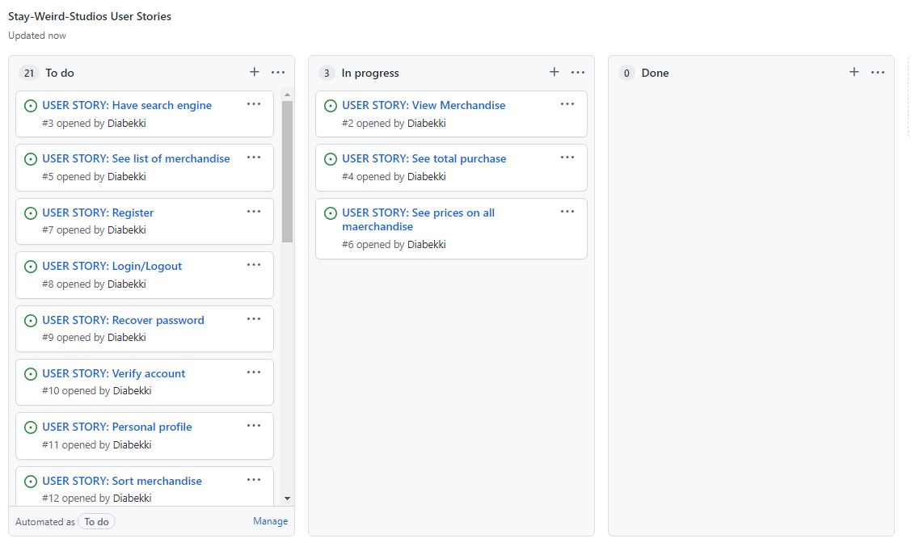
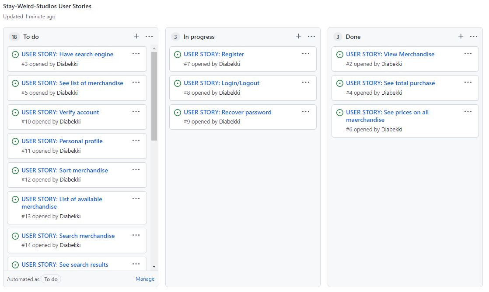
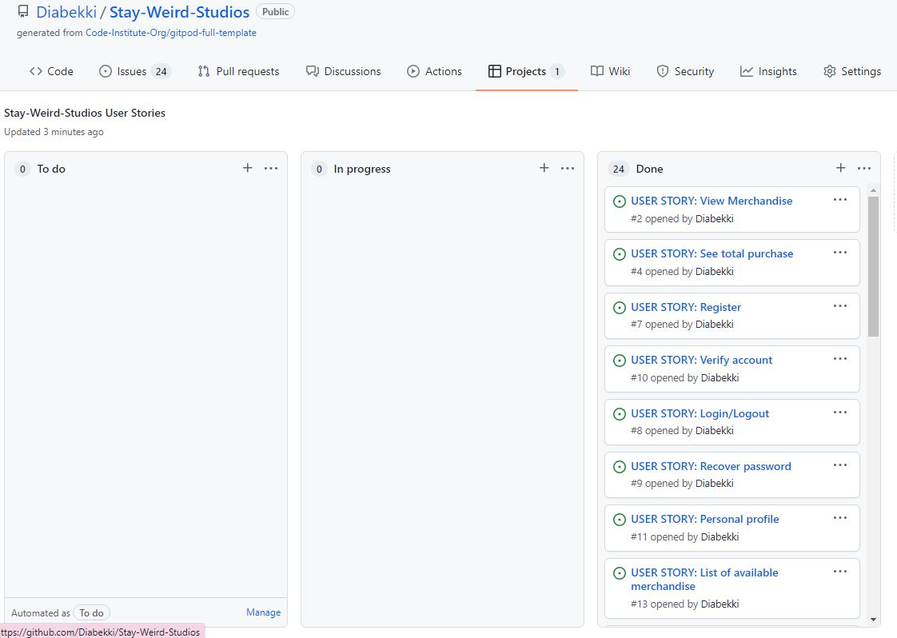

[^ back to top ^](#Table-of-contents)
 

## Scope

To achieve user and owner’s goals, below are the minimum features to be included in this project. Also, **CRUD** Create, Read, Update, and Delete functions are required for this project so these are implemented as a part of the essential features.

- Simple homepage that links to the merchandise page
- Register page and validate email/username with confirmation via email
- Sign in page where users can sign into and out of their accounts.
- Login page  
- Feedback form  
- Contact form
- Ability to sign up for newsletter in pop up for marketing purposes
- Ability to make payments using stripe for credit card and receive order confirmation via email
- Ability to Add, delete, update merchandise in merch admin
- Ability to add and remove merchandise from cart

[back to top](#Table-of-contents)
 

## Structure

The menu has the following navigation links:
- Title leads to home page
- "All Merchandise" leads to all merchandise page with option to sort by price, rating or category
- Clothing Merch leads to clothing page with option to view specifiic products by category
- Album leads to album view page

The footer has the following navigation links:
- Give us feedback button takes user to feedback form
- Contact us button takes user to contact form
- Git hub icon and name takes user to developers github profile. 
- Facebook icon and name takes user to business facebook page. 

The main pages of the website are:

- Homepage(index.html) - Which takes users to home page
- Checkout(cart_checkout.html) - Which takes user to checkout page
- Merchandise page(merchandise.html) - Which all merchandise 
- Merch view page(merch_details.html) - Which views merchandise 
- Add Merchandise page(add_merch.html) - Which adds merchandise  
- Edit Merchandise page(edit_merch.html) - Which edits merchandise 
- Feedback page (feedback.html) - Goes to feedback page  
- Contact us page(contact.html) - Goes to Contact us page 
 

[back to top](#Table-of-contents)
 

## Features
This e-commerce website features easy navigation to Weird Cylinder merchandise which consist of a different array of clothing and an album with a spotify link to the album 

## Wireframes 
Home Page
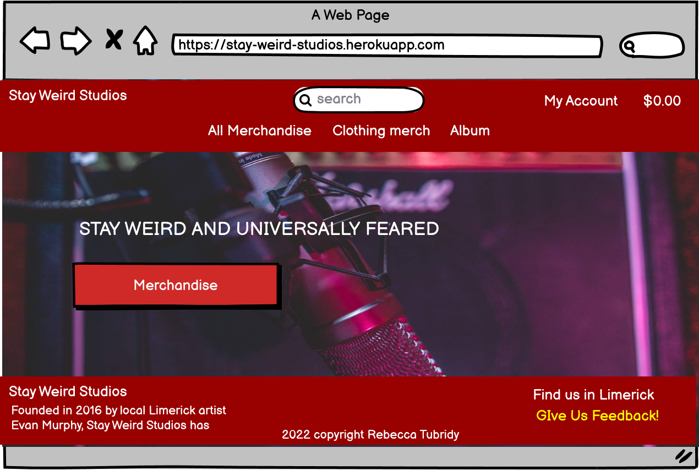

Merchandise Page
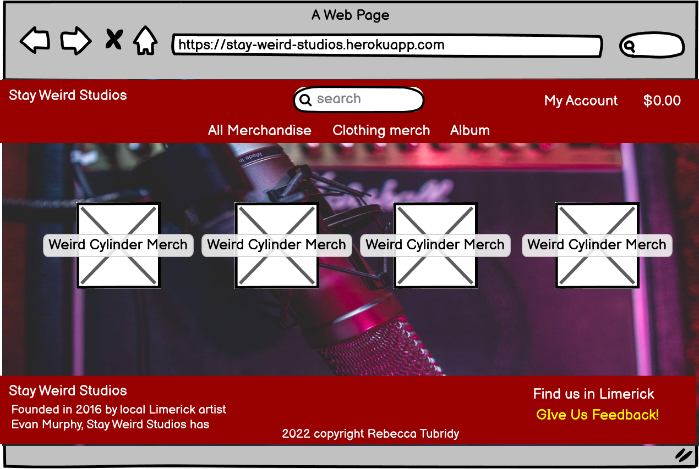

Sign In page
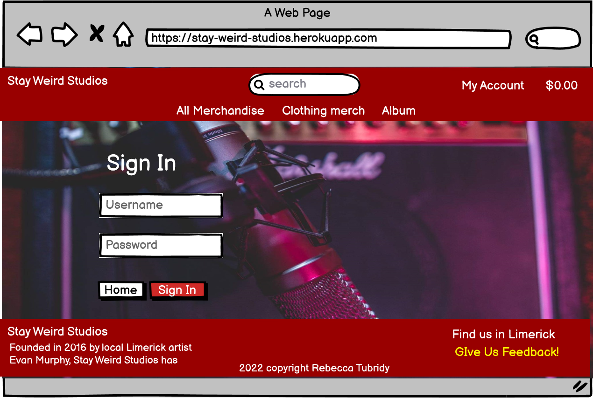

Sign up page
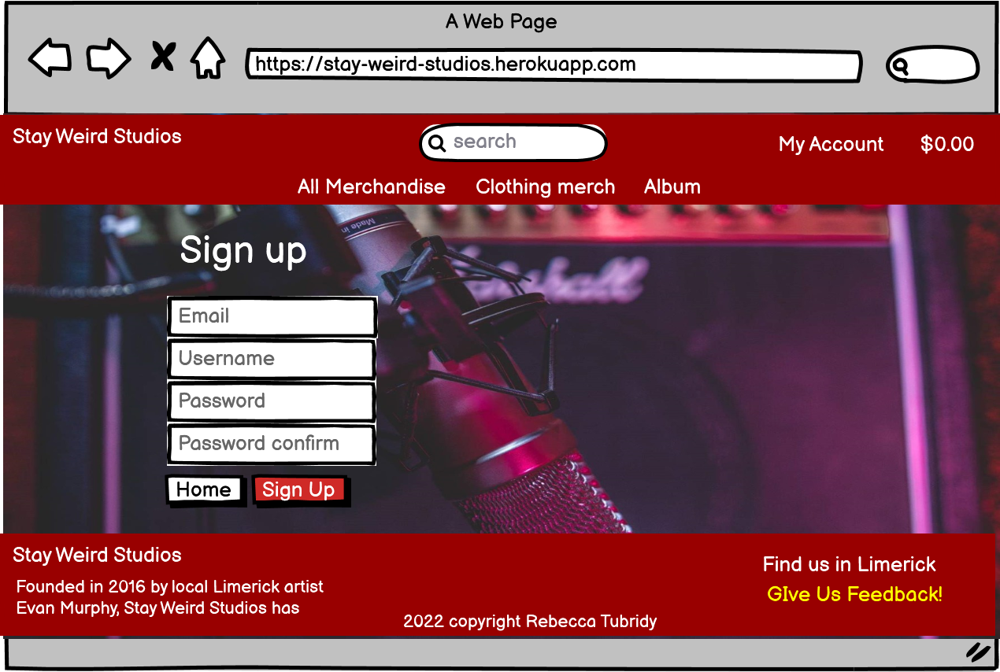

Shopping Cart Page
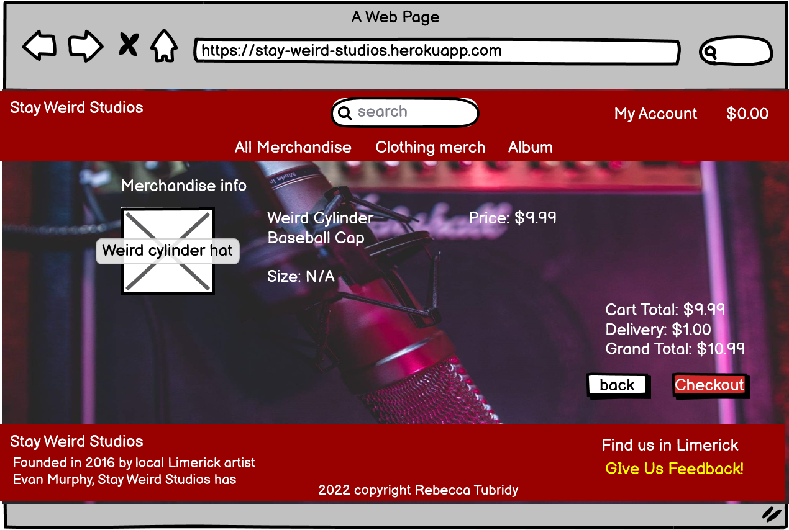

Checkout Page
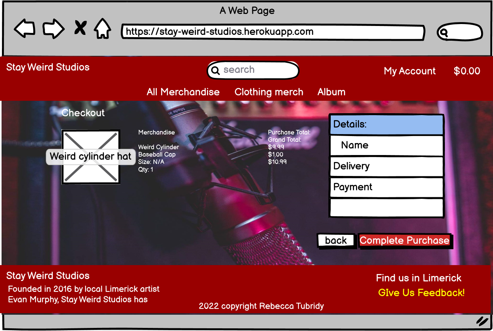

[back to top](#Table-of-contents)
 

# FEATURES

## Existing Features 
#### **Navigation menu displayed across all pages**

- Navigation menu
- Website Title that redirects to home page
- Contact Form
- Ability to create, read, update and delete products for admin
- Ability for admin to delete and verify users in admin panel
- Ability to comment on merchandise
- Ability for admin to approve of comments under merchandise
- Ability to sign in, sign out and register
- Ability to view merchandise, add merchandise to cart and remove merchandise from cart 
- Ability to update merchandise quantity and to check out and pay for order
- Stripe payments implemeted to ensure secure purchase

**Facebook Buisness Page**
  - A business page for stay weird studios.
  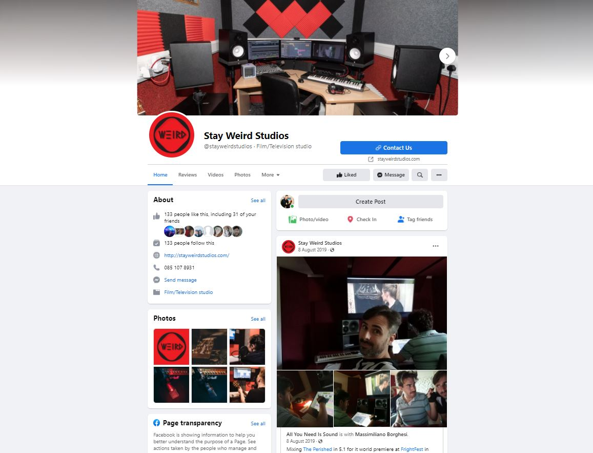
    - This is a screenshot taken from stay weird studios.
      The site is located on facebook and is a direct link for potential clients for gigs and such. 

 **Navigation Bar**
  
  - Navigation bar with high contrast font for easy reading
  - The nav title link brings user back to home.
  - There is a search section for easy navigation to merchandise
  - There is easy navigation to account and also checkout-cart

  ## Features to Implement in the future 

- More songs and albums to be added
- Create an update section for events
- Create a blog to allow the artist to express their thoughts with their fans
- Add an events page for gigs
- Have a page dedicated to teaching instruments
- Prices for services

[back to top](#Table-of-contents)
 

# Technologies Used

- [Django3](https://www.djangoproject.com/) framework
- [Postgressql](https://www.postgresql.org/) for the database
- [Bootstrap 4 ](https://mdbootstrap.com/) for bulk of CSS
- [JavaScript](https://en.wikipedia.org/wiki/JavaScript) for interaction
- [JQUERY](https://jquery.com/) for interaction
- [Python3](https://www.python.org/) as a backend 
- [Google Fonts](https://fonts.google.com/) for fonts
- [Font Awesome](https://fontawesome.com/) for icons
- [Stripe](https://stripe.com/ie) for payments section
- [Summernote](https://summernote.org/) editor for adding and editing updates
- [Gitpod](https://www.gitpod.io/) for cloud IDE
- [Git](https://git-scm.com/) for source control
- [GitHub](https://github.com/) for file and documents hosting
- [Heroku](https://www.heroku.com/) for website deployment

## Resources 

- Code Institute Course Materials
- [Stack Overflow](https://stackoverflow.com/)
- [YouTube](https://www.youtube.com/)
- [W3schools](https://www.w3schools.com/)
- [Google](https://www.google.com/)

## Tools

- [Balsamiq](https://balsamiq.com/) for wireframes
- [W3C Markup Validation Service](https://validator.w3.org/) for testing HTML code
- [W3C CSS Validation Service](https://jigsaw.w3.org/css-validator/) for testing CSS code
- [jshint](https://jshint.com/) for testing JavaScript code
- [PEP8 Online](http://pep8online.com/) for checking Python code compliance
- [Chrome DevTools](https://developers.google.com/web/tools/chrome-devtools) for testing, style checking and debugging

 ## Testing
 The entirety of the testing was done **manually**. 
 Manual testing can be found [here](testing.md)

- **PEP8 Flake** **JS** tests, **HTML and CSS Validators** were also done! 

- HTML Validation was done using **W3C Nu HTML Validator**:
 

**W3C HTML link validator** testing: 
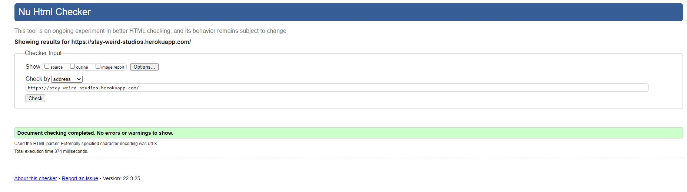

CSS Validation was done using **W3C Jigsaw Validator**:
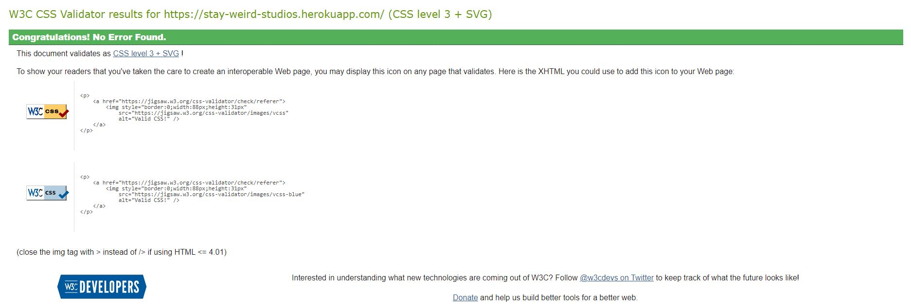

Python Validation was done using **Pep8**:
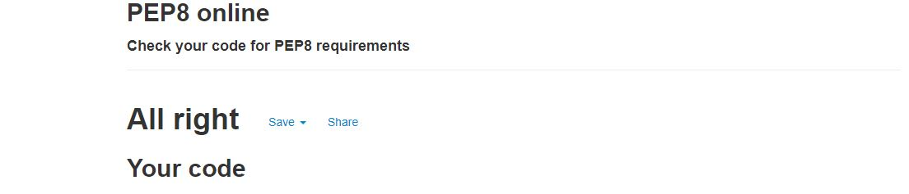
  

Other known errors or warnings were Missing module docstring/blank line at end of file and line too long. Errors not fixed would have broken code functionality if attempted.

**Lighthouse** testing was done using **Chrome Developer Tools** :

**Desktop** Test:
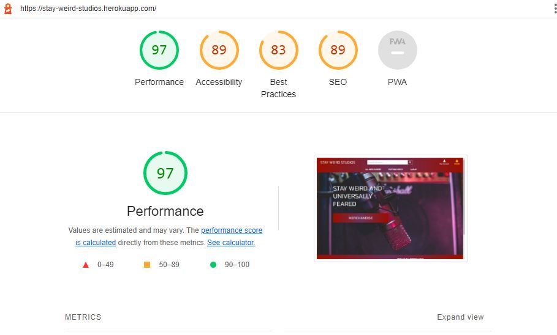

**Mobile** Test:
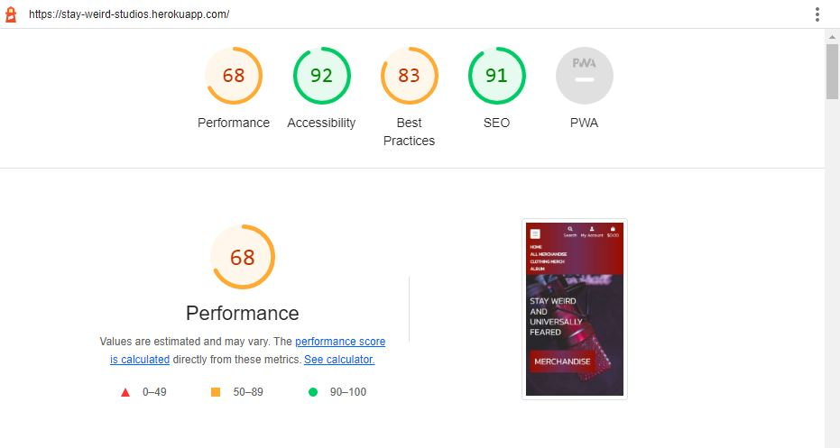

- User testing
    - through a personal group-chat I sent the deployed website to friends and family and received feedback from various devices.

the resolutions I have tested the website on are as follows 
- Desktop screen
    - 1024px & up width
- Laptop
    - 769px-1024px width
- Tablet
    - 481px-768px width
- Mobile 
    - 320px-480px width 

# Deployment
## Heroku Deployment
This website was deployed through Heroku:

1) A repository was created in github using the student template
2) The repo was pushed to the cloud based IDE called GITPOD
3) In the GITPOD terminal, django and its supporting libraries were installed using pip3
4) The project is then created using python3 manage.py startproject projectname
5) The first app is then created using python3 manage.py createapp appname
6) The app is then registered in the setting file in the project level settings.py. 
7) An app is then created in heroku and the installation of postgres is done under resources making sure to add postgres url to config vars
8) Back in the GITPOD terminal, install Django Database and psycopg2
9) Import dj database url in your settings file and replace default database with dj database passing it postgres url
10) Migrate database and load data in gitpod terminal 
11) Create another super user
12) Create an if else statement that checks the database url and runs the correct database accordingly. 
13) Install gunicorn, create a procfile and log into heroku in the terminal. 
14) Disable the static files using heroku config:set, DISABLE_COLLECTSTATIC=1 --app appname
15) Add heroku app and localhost to allow hosts in settings.py
16) Generate a secret key using Django secret key generator and add to config vars whilst linking it to settings.py
16) Add, commit and push changes to Github
17) Set heroku to automatically deploy by setting it to Github and searching/connecting to correct repo. 

[back to top](#Table-of-contents)
 

# Credits
### Code
* [Code Institute](https://codeinstitute.net/ie/) supplied the bulk of the tutorials, resources and support for this project!
* [Bootstrap](https://getbootstrap.com/) for creating a responsive site.
* [Twilio](https://getbootstrap.com/) for their contact form tutorial which was adapted to create mine
* [w3schools](https://www.w3schools.com/) was used as a general source of knowledge 
* [youtube](https://www.youtube.com/) 
* [Stack Overflow](https://stackoverflow.com/) 
* [MDN Web Docs](https://developer.mozilla.org/) for various tutorials and walkthroughs!
* [Django Docs](https://docs.djangoproject.com/en/3.2/) for django documentation.
* [Font Awesome](https://fontawesome.com/) were used throughout website
* [Mailchimp](https://mailchimp.com/) was used to create the subscribe newsletter for the webpage 

## Media 
- Image media was taken from
   - Facebook https://facebook.com/
   - With regards to images and information regarding WeirdCylinder and Stay Weird Studios, I was giving full permission to use all relevent information by the owner Evan Murphy. 

### Acknowledgements
* I want to thank my Fiance who kept pushing me to keep bettering myself and not letting me give up and for giving me advice on how get the readme to sound more structured and professional.
* Fellow students for letting me vent frustrations when I felt overwhelmed with the work and helping deal with the emotional pressure of course work not going as planned. 
* I did not have a mentor through this project due to previous issues so I had to do this project more so on my own.