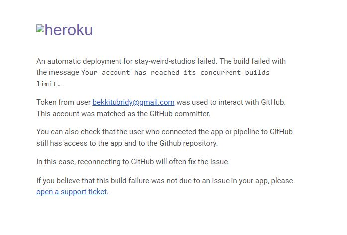
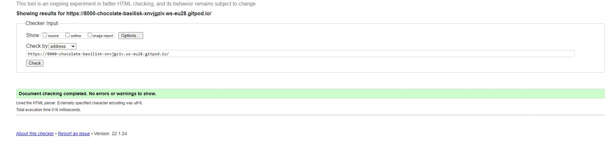
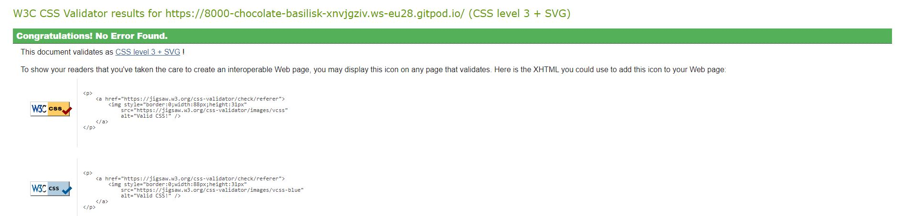
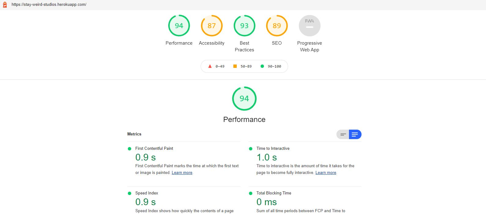

# Stay Weird Studios

## **Code Institute - Portfolio Project 5: Ecommerce Project** 

This is a e-commerce website based for a local studio run by my fiance and a fun project to help a local business owner gain traction and stand out in the music scene in Limerick.

## Table of contents
+ [User Experience](#User-Experience)
     + [Project Goals](#Project-Goals)
     + [User Stories](#User-Stories)
     + [Strategy](#Strategy)
     + [Scope](#Scope)
     + [Structure](#Structure)
     + [Skeleton](#Skeleton)
          + [Wireframes](#Wireframes)
     + [Surface](#Surface)
+ [Features](#Features) 
     + [Existing Features](#Existing-Features)
     + [Features to Implement in the future](#Features-to-Implement-in-the-future)
+ [Database](#Database)
+ [Testing](#Testing)
+ [Bugs](#Bugs)
+ [Technologies Used](#Technologies-Used)
     + [Resources](#Resources)
     + [Tools](#Tools)
+ [Deployment](#Deployment)
     + [Heroku Deployment](#Heroku-Deployment)
+ [Credits](#Credits)

***
# User Experience
## Project Goals
The primary goal of this project is to create a ecommerce store for Stay Weird Studios using its branding to create a pleasant user experience for anyone who wishes to purchase any merchandise which consist of a different array of clothing aswell as means of supporting the artist by paying for an album. 

## User Stories

### Core 
- As a **shopper** I want to be able to **view merchandise** so I can **browse the website for purchases**
- As a **shopper** I want to be able to **clearly see specific merch and service** so I can **avoid searching through the entire site or range of products**
- As a **shopper** I want to be able to **identify deals** so I can **see special offers to save money**
- As a **shopper** I want to be able to **quickly see my total of purchases** so I can **avoid spending too much**
- As a **shopper** I want to be able to **see list of services** so I can **pick the specific service for my needs**
- As a **shopper** I want to be able to **see the price of all services** so I can **know price in advance of payment**

### Authentication 
- As a **site user** I want to be able to **register for an account** so I can **view my personal profile**
- As a **site user** I want to be able to **login and logout** so I can **access and secure my personal information**
- As a **site user** I want to be able to **recover my password** so I can **recover access to account if password is forgotton**
- As a **site user** I want to be able to **receive confirmation email** so I can **verify my account**
- As a **site user** I want to be able to **have a personal profile** so I can **save payment information**

### Sorting/Searching

- As a **shopper** I want to be able to **sort specific products/services** so I can **find the best price for those products/services**
- As a **shopper** I want to be able to **see list of available products/services** so I can **find and purchase one I need**
- As a **shopper** I want to be able to **search for products/services by name** so I can **easily find a specific product/service**
- As a **shopper** I want to be able to **easily see results and availability from search** so I can **quickly see if that product/service is currently available**

### Payment

- As a **shopper** I want to be able to **select size and quantity of merch** so I can **ensure the wrong size/quantity is not purchased**
- As a **shopper** I want to be able to **view items or service in cart** so I can **identify total cost for checkout**
- As a **shopper** I want to be able to **alter quantity of goods** so I can **make changes before purchasing**
- As a **shopper** I want to be able to **enter payment details** so I can **buy services or products**
- As a **shopper** I want to be able to **ensure I feel safe purchasing** so I can **make payments confidentially**
- As a **shopper** I want to be able to **view order confirmation after checkout** so I can **verify there are no mistakes in my order or details**
- As a **shopper** I want to be able to **receive email after checkout** so I can **confirm payment for order was successful**

### Admin

- As a **store owner** I want to be able to **add products** so I can **add new merchandise and services to store**
- As a **store owner** I want to be able to **edit/update products/services** so I can **change item details if needed**
- As a **store owner** I want to be able to **delete products** so I can **remove items/services no longer available**

# Example
- As a **** I want to be able to **** so I can ****

[^ back to top ^](#Table-of-contents)
 

## Scope

To achieve user and owner’s goals, below are the minimum features to be included in this project. Also, **CRUD** Create, Read, Update, and Delete functions are required for this project so these are implemented as a part of the essential features.

- Simple homepage that links to the products page
- Register page and validate email/username with confirmation via email
- Sign in page where users can sign into and out of their accounts.
- Login page  
- Feedback form  
- Contact form
- Ability to sign up for newsletter in pop up for marketing purposes
- Ability to make payments using stripe for credit card and receive order confirmation via email
- Ability to Add, delete, update products in product admin
- Ability to add and remove products from cart

[back to top](#Table-of-contents)
 

## Structure

The entire web app has the same menu and footer. 

The menu has the following navigation links:
- Title leads to home page
- All Merchandise leads to all merchandise page with option to sort by price, rating or category and all merchandise option
- Clothing Merch leads to clothing page with option to view specifiic products by category
- Album leads to album view page

The footer has the following navigation links:
- Basic newsletter sign up form powered by mailchimp
- Give us feedback button takes user to feedback form
- Contact us button takes user to contact form
- Git hub icon and name takes user to developers github profile. 
- Facebook icon and name takes user to store facebook page. 

The main pages of the website are:

- Homepage(index.html) - Which takes users to home page
- Checkout(cart_checkout.html) - Which takes user to checkout page
- Merchandise page(merchandise.html) - Which all merchandise 
- Merch view page(merch_details.html) - Which views merchandise 
- Add Merchandise page(add_merch.html) - Which adds merchandise  
- Edit Merchandise page(edit_merch.html) - Which edits merchandise 
- Feedback page (feedback.html) - Goes to feedback page  
- Contact us page(contact.html) - Goes to Contact us page 
 

[back to top](#Table-of-contents)
 

## Features
This e-commerce website features easy navigation to Weird Cylinder merchandise which consist of a different array of clothing and an album with a spotify link to the album 

## Wireframes 
Home Page

Merchandise Page

Sign In page

Sign up page

Shopping Cart Page

Checkout Page

[back to top](#Table-of-contents)
 

# FEATURES

## Existing Features 
#### **Navigation menu displayed across all pages**

- Navigation menu
- Website Title that redirects to home page
- Contact Form
- Ability to create, read, update and delete products for admin
- Ability for admin to delete and verify users in admin panel
- Ability to sign in, sign out and register
- Ability to view merchandise, add merchandise to cart and remove merchandise from cart 
- Ability to update merchandise quantity and to check out and pay for order

**Existing Features**
 **Navigation Bar**
  
  - Navigation bar on all pages, high contrast font for easy reading
  - the nav title link brings user back to home.
  - There is a search section for easy navigation to merchandise
  - There is easy navigation to account and also checkout-cart

  ## Features to Implement in the future 

- More song and albums to be added
- Create a updates section for events
- Create a blog to allow the artist to express their thoughts with their fans
- Add an events page for gigs
- Have a page dedicated to teaching instruments
- Prices for services

[back to top](#Table-of-contents)
 

 
  **Facebook Buisness Page**
  - A buisness page for stay weird studios.
  

# Technologies Used

- [Django3](https://www.djangoproject.com/) framework
- [HTML5](https://en.wikipedia.org/wiki/HTML) for markup
- [CSS3](https://en.wikipedia.org/wiki/CSS) for style
- [Postgressql](https://www.postgresql.org/) for the database
- [Bootstrap 4 ](https://mdbootstrap.com/) for bulk of CSS
- [JavaScript](https://en.wikipedia.org/wiki/JavaScript) for interaction
- [JQUERY](https://jquery.com/) for interaction
- [Python3](https://www.python.org/) as a backend 
- [Google Fonts](https://fonts.google.com/) for fonts
- [Font Awesome](https://fontawesome.com/) for icons
- [Amazon AWS](https://aws.amazon.com/) for image and static files hosting
- [Summernote](https://summernote.org/) editor for adding and editing updates
- [Gitpod](https://www.gitpod.io/) for cloud IDE
- [Git](https://git-scm.com/) for source control
- [GitHub](https://github.com/) for file and documents hosting
- [Heroku](https://www.heroku.com/) for website deployment

## Resources 

- Code Institute Course Materials
- [Stack Overflow](https://stackoverflow.com/)
- [YouTube](https://www.youtube.com/)
- [W3schools](https://www.w3schools.com/)
- [Google](https://www.google.com/)

## Tools

- [Balsamiq](https://balsamiq.com/) for wireframes
- [W3C Markup Validation Service](https://validator.w3.org/) for testing HTML code
- [W3C CSS Validation Service](https://jigsaw.w3.org/css-validator/) for testing CSS code
- [jshint](https://jshint.com/) for testing JavaScript code
- [PEP8 Online](http://pep8online.com/) for checking Python code compliance
- [Chrome DevTools](https://developers.google.com/web/tools/chrome-devtools) for testing, style checking and debugging

 ## Testing
- Issues faced
    - An error causing the marchandise to show a server error (locally this was solved but upon deployment it returned error 500)
    - In relation to the clothing when selecting sizes the page showed an error that it was unable to find the merchandise (locally this was fixed but upon deployment it returned an error 500)
    - Comments are returning an error, I believe this is a database issue in relation to migrations after deployment to heroku. 
    - Stripe payments stopped working at an unknown point in development, after reviewing with my peers this seemed to be a common issue after deployment to heroku.

- JavaScript issues
    - Initally there was an issue when adding or removing multiples of an item. This error is fixed.

- Deployment Issues
    - Heroku deployment caused many issues that I did not have the time available to fix. I believe that it is a database issue and that the data did not automaticly deploy as is should when pushed.
 
       

- User testing
    - through a personal group-chat I sent the deployed website to friends and family and received feedback from various devices.
    - I had review the page to give me opinions on further development. 

- Summary
    - In summary locally the website worked well and was fully functional. Upon deployment what I expect to be a database issue has cause most models to fail functionally.  

the resolutions I have tested the website on are as follows 
- Desktop screen
    - 1024px & up width
- Laptop
    - 769px-1024px width
- Tablet
    - 481px-768px width
- Mobile 
    - 320px-480px width 

### Validator Testing 
- HTML
  - No error found when ran through W3C validator https://validator.w3.org/

- CSS 
  - No error found when ran through W3C validator https://validator.w3.org/
  

 - Lighthouse 
 

  ## Deployment 

- The website was deployed through Heroku 
  - I went on to the Heroku website 
  - Clicked on "Create-New-App"
  - Named my project and stated what region I live in
  - I clicked into settings 
  - Clicked into Deploy 
  - Connected to my GitHub
  - Searched for my project name repository and clicked connect
  - Enabled automatic deploys
  - Clicked "Deploy Branch" 

  The live links to my project are - 
   - https://stay-weird-studios.herokuapp.com/

   - https://8000-chocolate-basilisk-xnvjgziv.ws-eu28.gitpod.io/ 

   - There seems to be an issue with pushing to Heroku, the details from the local are not translating over to the deployed site.

  ## Credits
  - Fonts used throughout website was taken from Google Fonts https://fonts.google.com/
  - Mailchimp was used to create the newsletter for the webpage https://mailchimp.com/

## Media 
- Image media was taken from
   - Facebook https://facebook.com/
   - With regards to images and information regarding WeirdCylinder and Stay Weird Studios, I was giving full permission to use asll relevent information by the owner Evan Murphy. 

## Acknowledgements

I want to thank my Fiance who kept pushing me to keep bettering myself and not letting me give up and for giving me advice on how get the readme to sound more structured and professional.
Fellow students for letting me vent frustrations when I felt overwhelmed with the work and helping deal with the emotional pressure of course work not going as planned.
I did not have a mentor through this project due to previous issues so I had to do this project more so on my own.
