# Stay Weird Studios

This is a e-commerce website based for a local studio run by my fiance and a fun project to help a local business owner gain traction and stand out in the music scene in Limerick.

## Features
This e-commerce website features easy navigation to Weird Cylinder merchandise which consist of a different array of clothing and an album with a spotify link to the album 

## Wireframe 

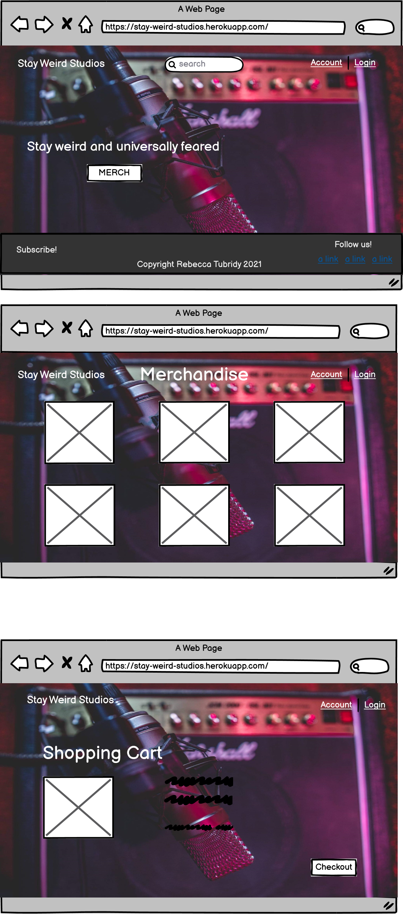

**Existing Features**
 **Navigation Bar**
  
  - Navigation bar on all pages, high contrast font for easy reading
  - the nav title link brings user back to home.
  - There is a search section for easy navigation to merchandise
  - There is easy navigation to account and also checkout-cart

  

  **Main page text**
  - Main page is simple and clean with a calming color scheme and easy to read writing 
  - Merchandise button gives easy access to items that can be purchased

  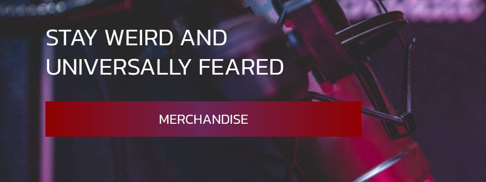

 **Main page image**
  - The image chosen fit very well with the page intent.
  - The colourful image conveys what the user should be expecting from the page.
  - User will be very much aware of the musical intent for this website
 

 **Footer, copyright text** 
  - The footer consists of a red to purple gradient for a sleek vibe that is in sync with the websites theme.
  - I kept the footer simple for the same reason the navigation bar was styled simplistically, users can easily find their way around the footer

   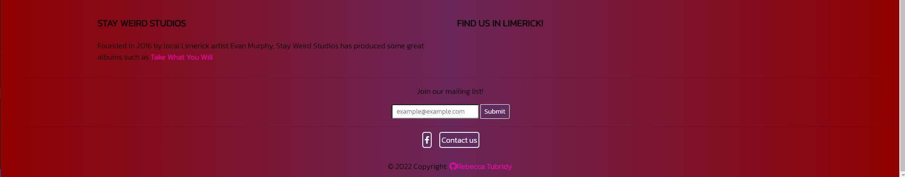

**Features in navbar**
  - Navbar has access to all merchandise categories from size to price.

  

  - Clothing merchandise selector.
  

  - The aim of the quiz is to be both fun and challenging to the user.
  

  - Account selector 
  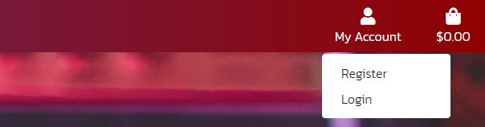

**Merchandsie** 
  - Merchandise section has a selection of Weird Cylinder clothing
  - The brand consists of casual and comfortable clothing items
  - Nice tags and contrast price have been used in the cards to help items pop out to users
  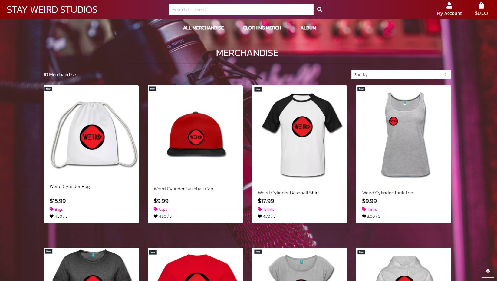

 - There is also items such as hats and bags available 
  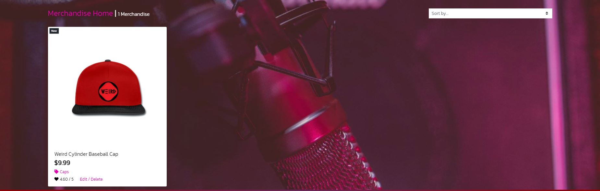
  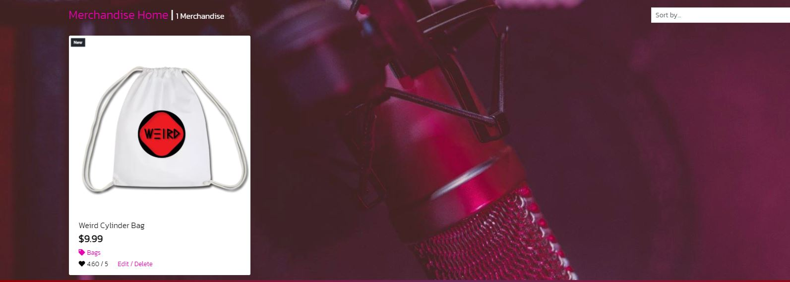

 - An album available to purchase
  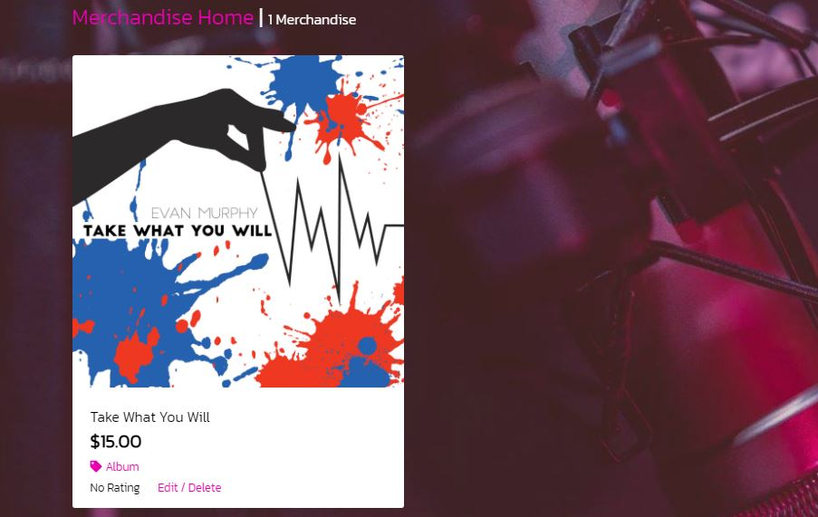

- Songs can be sampled from Spotify before purchase
  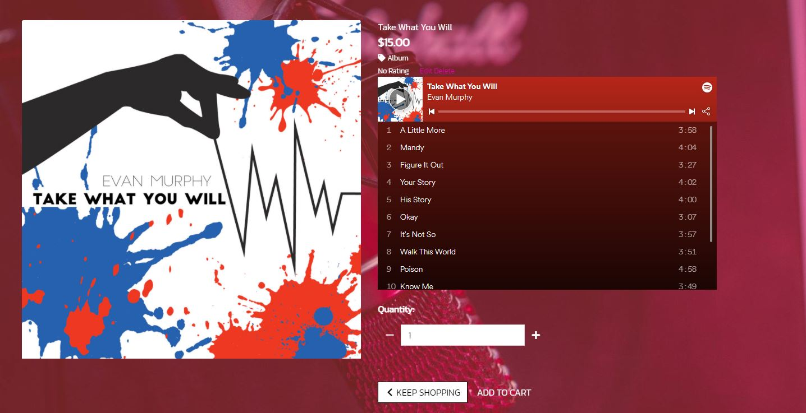

 **After item is selected** 
   - Selected item has a size option ranging from xs to xl
   - The image is large for accessibility 
   - Style was kept simple in order not to confuse customers
  
   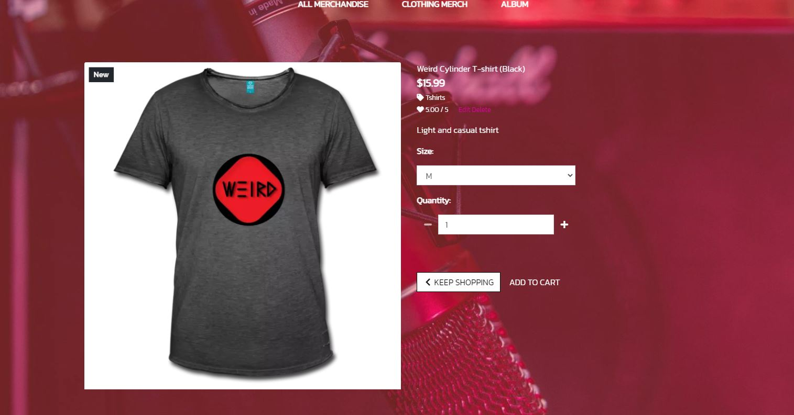

   **Comments**
   - User can comment on items they like and or give a review comment of how things can improve 

   

   **Merchandise Mangement**
   - A section where registered users can add merchandsie to the website
   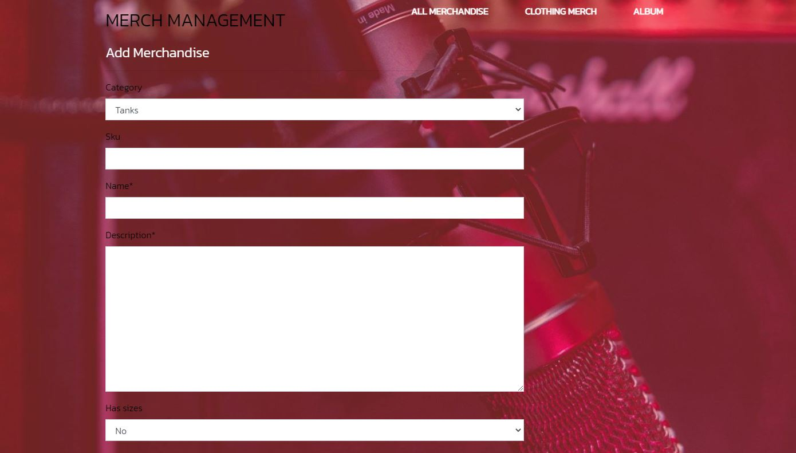

   **User Profile**
   - A profile section for registered users to update their information and see purchase history
   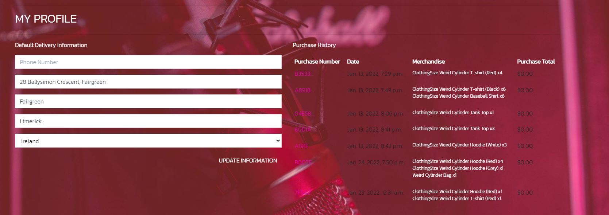

   **Cart Add**
   - User gets notification of their selected item added to the cart 
   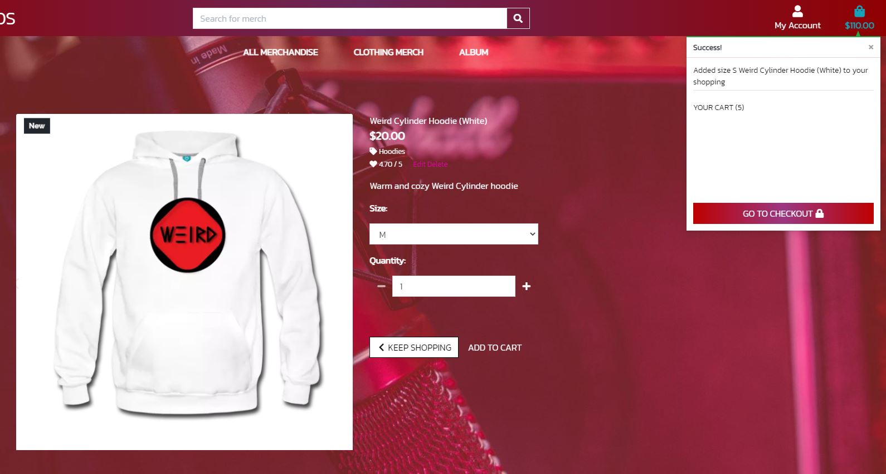

   **Checkout**
   - User gets taken to page to checkout their item for purchase
   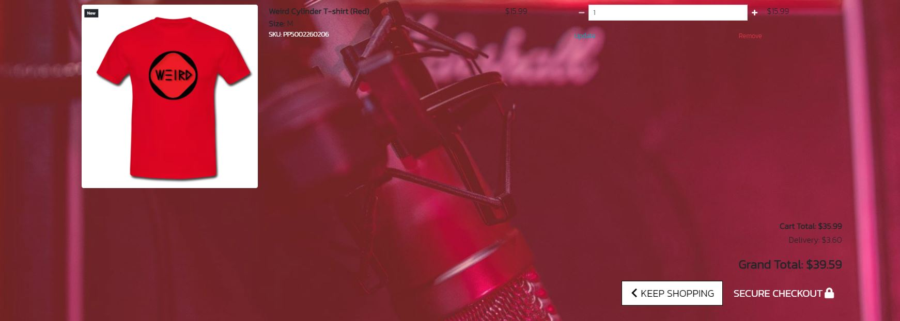

   - Payment area for checkout
  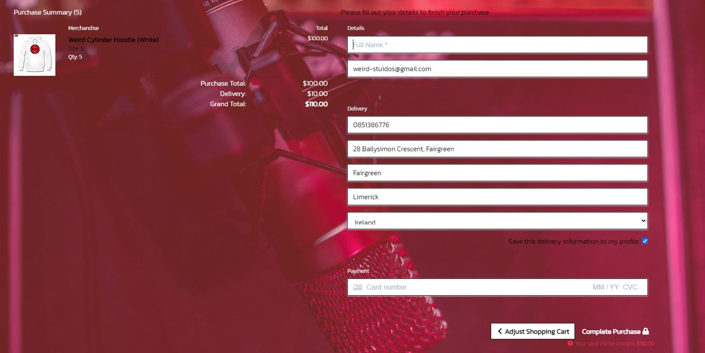

  - Area for completed purchases
  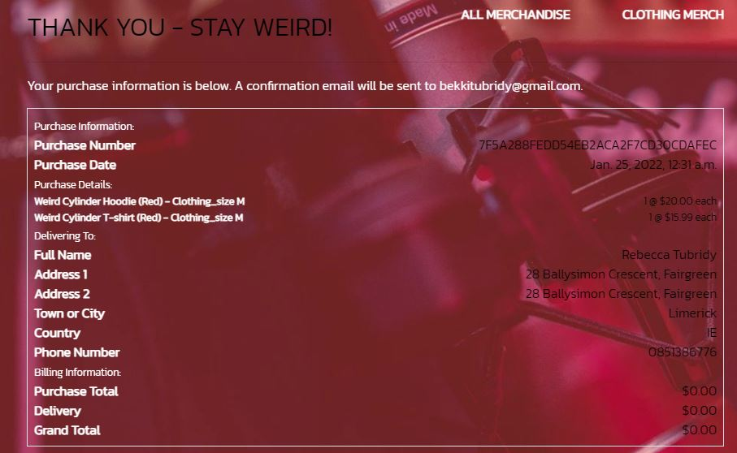

  **Contact us**
  - A page to contact us for users to get in touch
  

  - A thank you page after submitting contact query
  
 
  **Facebook Buisness Page**
  - A buisness page for stay weird studios.
  

  **Features left to add**
    - More merchandise to be added.
    - More songs and albums to be added.
    - Create a section to track upcoming events related to stay weird studios.
    - Create a blog to allow the artist to express their thoughts and feelings of the music being produced.

 ## Testing
- Issues faced
    - An error causing the marchandise to show a server error (locally this was solved but upon deployment it returned error 500)
    - In relation to the clothing when selecting sizes the page showed an error that it was unable to find the merchandise (locally this was fixed but upon deployment it returned an error 500)
    - Comments are returning an error, I believe this is a database issue in relation to migrations after deployment to heroku. 
    - Stripe payments stopped working at an unknown point in development, after reviewing with my peers this seemed to be a common issue after deployment to heroku.

- JavaScript issues
    - Initally there was an issue when adding or removing multiples of an item. This error is fixed.

- Deployment Issues
    - Heroku deployment caused many issues that I did not have the time available to fix. I believe that it is a database issue and that the data did not automaticly deploy as is should when pushed.
 
       

- User testing
    - through a personal group-chat I sent the deployed website to friends and family and received feedback from various devices.
    - I had review the page to give me opinions on further development. 

- Summary
    - In summary locally the website worked well and was fully functional. Upon deployment what I expect to be a database issue has cause most models to fail functionally.  

the resolutions I have tested the website on are as follows 
- Desktop screen
    - 1024px & up width
- Laptop
    - 769px-1024px width
- Tablet
    - 481px-768px width
- Mobile 
    - 320px-480px width 

### Validator Testing 
- HTML
  - No error found when ran through W3C validator https://validator.w3.org/

- CSS 
  - No error found when ran through W3C validator https://validator.w3.org/
  

 - Lighthouse 
 

  ## Deployment 

- The website was deployed through Heroku 
  - I went on to the Heroku website 
  - Clicked on "Create-New-App"
  - Named my project and stated what region I live in
  - I clicked into settings 
  - Clicked into Deploy 
  - Connected to my GitHub
  - Searched for my project name repository and clicked connect
  - Enabled automatic deploys
  - Clicked "Deploy Branch" 

  The live links to my project are - 
   - https://stay-weird-studios.herokuapp.com/

   - https://8000-chocolate-basilisk-xnvjgziv.ws-eu28.gitpod.io/ 

   - There seems to be an issue with pushing to Heroku, the details from the local are not translating over to the deployed site.

  ## Credits
  - Fonts used throughout website was taken from Google Fonts https://fonts.google.com/
  - Mailchimp was used to create the newsletter for the webpage https://mailchimp.com/

## Media 
- Image media was taken from
   - Facebook https://facebook.com/
   - With regards to images and information regarding WeirdCylinder and Stay Weird Studios, I was giving full permission to use asll relevent information by the owner Evan Murphy. 

## Acknowledgements

I want to thank my Fiance who kept pushing me to keep bettering myself and not letting me give up and for giving me advice on how get the readme to sound more structured and professional.
Fellow students for letting me vent frustrations when I felt overwhelmed with the work and helping deal with the emotional pressure of course work not going as planned.
I did not have a mentor through this project due to previous issues so I had to do this project more so on my own.